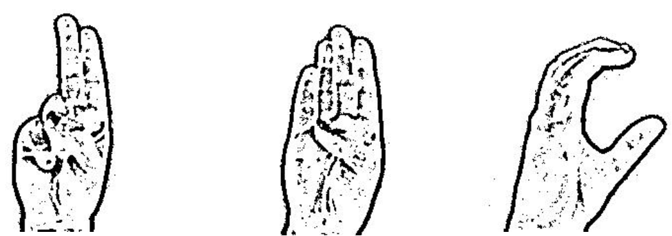

# Reconnaissance de la langue des signes

## Introduction <sub><i>Par Youssef Mourchid</i></sub>

Beaucoup de progrès et de recherches en IA ont été faites pour aider les personnes sourdes et muettes. L'apprentissage profond et la vision par ordinateur peuvent également être utilisés pour avoir un impact sur cette cause.

Cela peut être très utile pour les personnes sourdes et muettes dans la communication avec les autres car la connaissance de la langue des signes n'est pas quelque chose qui est commun à tous, de plus, cela peut être étendu à la création des éditeurs automatiques, où la personne peut facilement écrire par ses simples gestes.

## Utilisation de base:
Pour cloner le projet sur votre ordinateur à partir d'un terminal:
```
git clone https://github.com/sialorama/Detection_des-_emotions.git
cd mon_dossier
```
## Création du jeu de données
Chaque signe est associé à une lettre. Grace au filtre ```Threshold``` nous allons appliquer un seuillage sur les images.
```python
# Fonction pour l'application du filtre (Thresholded)
def segment_hand(frame, threshold=20):
    global background
    
    diff = cv2.absdiff(background.astype("uint8"), frame)
    thresholded = cv2.adaptiveThreshold(diff,255,cv2.ADAPTIVE_THRESH_GAUSSIAN_C, cv2.THRESH_BINARY,11,2)
    
    return (thresholded)
```
#### Résultat :

   
## Modèle
Le model de réseau de neurones CNN est le suivant:
```python
model = tf.keras.Sequential()

model.add(tf.keras.layers.Conv2D(filters=32, kernel_size=(3,3), activation='relu', input_shape=(IMG_SIZE, IMG_SIZE, 3)))
model.add(tf.keras.layers.Conv2D(filters=64, kernel_size=(3,3), activation='relu'))
model.add(Dropout(0.8))

model.add(tf.keras.layers.Conv2D(filters=128, kernel_size=(3,3), activation='relu'))
model.add(Dropout(0.8))

model.add(tf.keras.layers.Flatten())
model.add(Dropout(0.8))

model.add(tf.keras.layers.Dense(32, activation='relu'))
model.add(tf.keras.layers.Dense(64, activation='relu'))
model.add(tf.keras.layers.Dense(128, activation='relu'))
model.add(tf.keras.layers.Dense(27, activation='softmax'))

model.compile(optimizer ='adam',
             loss = 'categorical_crossentropy',
             metrics = ['accuracy'])
```

## Evaluation du modèle

La val_accuracy atteint 96%. Résultat satisfaisant au vu de la courbe Loss et Val_loss.  
  
  

## Matrice de confusion
La matrice de confusion montre que la majorité des lettre on été bien classées.


